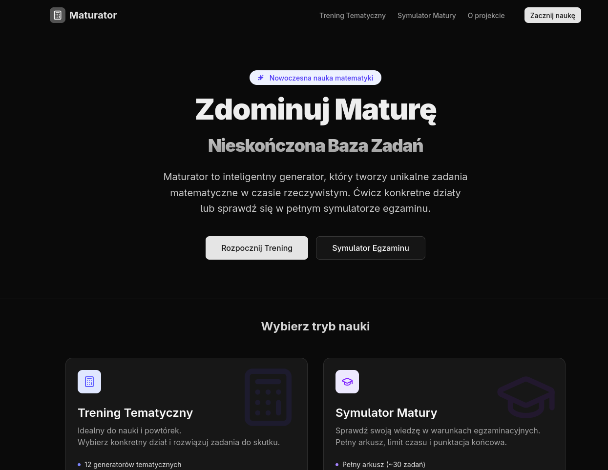

# Maturator 🎓

**Maturator** is an advanced, open-source educational platform designed to help students master the Polish High School Exit Exam in Mathematics (Matura). 

Unlike traditional textbooks or static question banks where you eventually run out of exercises, Maturator uses a powerful algorithmic engine to **generate unique math problems in real-time**. You can solve the same type of task 100 times, and the numbers, context, and result will be different every time.



## 🚀 Key Features

* **♾️ Infinite Problem Generation**: Powered by my custom backend, tasks are generated on-the-fly. No static databases, no memorizing answers.
* **Two Study Modes**:
    * **Thematic Training**: Focus on specific topics like Algebra, Geometry, Functions, or Probability and more.
    * **Exam Simulator**: A full-scale simulation of the real exam. 30+ tasks, 180-minute timer, and a detailed score report at the end.
* **Dynamic Visualizations**: Geometry and function problems come with dynamically generated SVG graphs and figures that match the specific random values of the task.
* **Smart Math Input**: A custom input interface that allows users to easily type complex mathematical symbols (roots, fractions, powers).
* **Instant Feedback**: Immediate validation for closed (ABCD) and open-ended questions.

## 🧠 The Engine

This project is the frontend interface for a larger ecosystem. The logic behind the mathematical generation resides in my standalone API:

👉 **[matura-engine](https://github.com/wolfie-university/matura-engine)**

The engine handles the randomization logic, LaTeX formatting, SVG generation, and solution step creation, which Maturator then consumes and renders beautifully.

## 🛠️ Tech Stack

* **Framework**: [Next.js](https://nextjs.org/) (App Router)
* **Language**: TypeScript
* **Styling**: [Tailwind CSS](https://tailwindcss.com/)
* **UI Components**: [shadcn](https://ui.shadcn.com/)
* **Math Rendering**: [KaTeX](https://katex.org/)
* **State & Fetching**: React Query (TanStack Query)
* **Icons**: Lucide React

## 📦 Installation

To run this project locally, follow these steps:

1.  **Clone the repository:**
    ```bash
    git clone https://github.com/wolfie-university/maturator.git
    cd maturator
    ```

2.  **Install dependencies:**
    ```bash
    npm install
    # or
    yarn install
    ```

3.  **Configure Environment:**
    Create a `.env.local` file in the root directory and add the URL to the running instance of `matura-engine`:
    ```env
    NEXT_PUBLIC_API_URL=http://localhost:3333/api/v2
    ```
    *(Note: You must have [matura-engine](https://github.com/wolfie-university/matura-engine) running locally or use a deployed URL).*

4.  **Run the development server:**
    ```bash
    npm run dev
    ```

5.  Open [http://localhost:3000](http://localhost:3000) with your browser.

## 📂 Project Structure

```plaintext
src/
├── app/              # Next.js App Router pages
├── components/       # React components
│   ├── ui/           # Reusable UI elements (shadcn)
│   ├── math/         # Math-specific components (Input, Renderer, TaskCard)
│   └── layout/       # Navbar, Footer
├── hooks/            # Custom React hooks (React Query wrappers)
├── lib/              # Utilities, constants, and math parsers
└── types/            # TypeScript interfaces for API responses
```

## 🤝 Contributing

Contributions are welcome! If you have ideas for new features or want to improve the UI:

1. Fork the repository.

2. Create a new branch (git checkout -b feature/AmazingFeature).

3. Commit your changes (git commit -m 'Add some AmazingFeature').

4. Push to the branch (git push origin feature/AmazingFeature).

5. Open a Pull Request.

## 📜 License

Distributed under the MIT License. See [LICENSE](./LICENSE) for more information.

## ✍️ Author

Szymon Wilczek

- GitHub: @szymonwilczek

- Website: [https://szymon-wilczek.me](https://szymon-wilczek.me)

<tr/>

Built with ❤️ for students preparing for the Matura exam.
